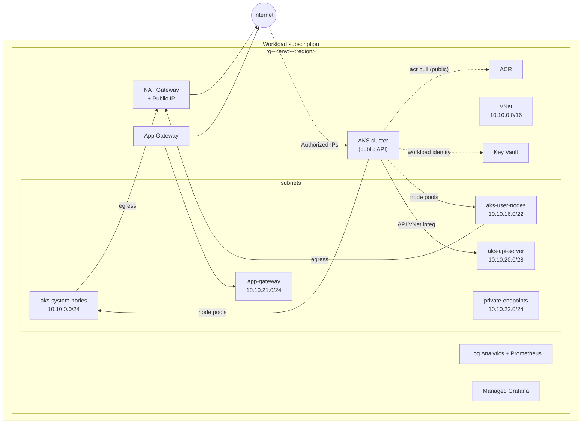
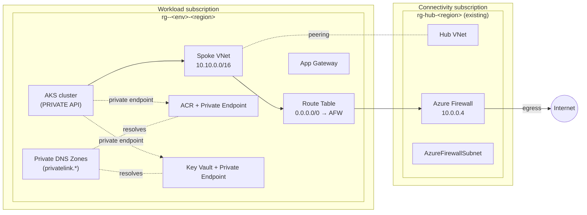
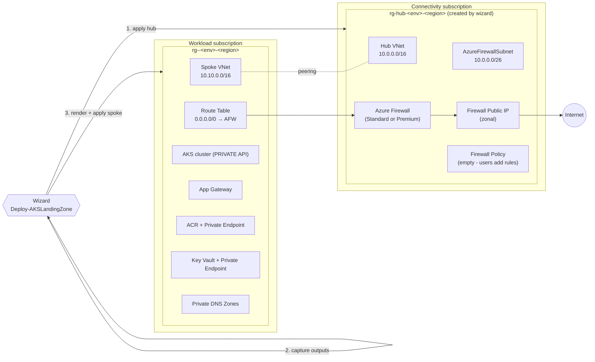
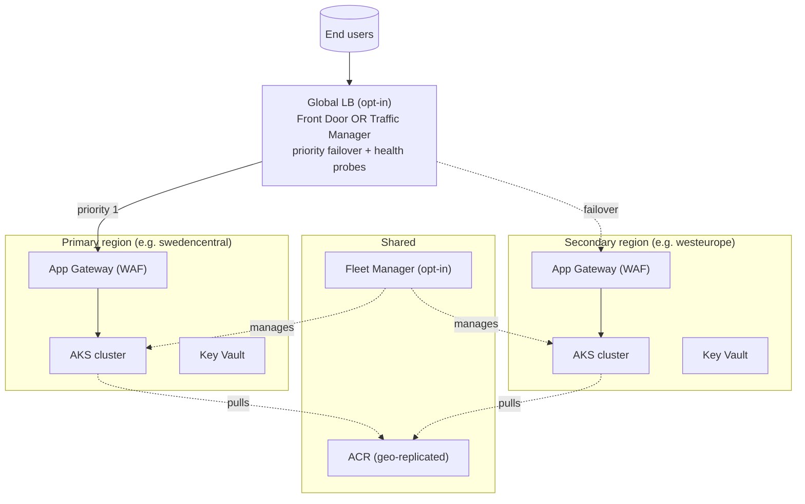

# Architecture Diagrams — Per Topology

Visual reference for the three topologies supported by `Deploy-AKSLandingZone`
v1.4.0-rc1. For per-scenario tfvars details see
[scenarios-and-options.md](scenarios-and-options.md).

---

## Topology 1: `standalone`

Cheapest path — no hub, NAT egress only, public API server (dev-friendly default).

Scenarios: **01**, **04**, **07**, **11**

**Key properties**:
- `is_corp = false` (no private endpoints, no UDR, no private DNS zone)
- API server reachable from the public internet (gated by authorized IP ranges)
- Egress via NAT Gateway (predictable SNAT IP, no SNAT exhaustion)

---

## Topology 2: `spoke`

Brownfield — connects to an **existing** ALZ hub VNet, forced egress via hub firewall, private cluster.

Scenarios: **02**, **05**, **08**, **12**

**Key properties**:
- `is_corp = true` (private endpoints, UDR, private DNS, private cluster)
- Hub already exists in `connectivity_subscription_id`
- All egress forced through the hub firewall (compliance / inspection)

---

## Topology 3: `hub_and_spoke`

Greenfield — wizard creates the **hub first**, then the spoke consumes hub outputs.

Scenarios: **03**, **06**, **09**, **10**

**Key properties**:
- Two-phase apply: hub composition (separate state) then spoke
- Hub state lives in `bootstrap/alz/hub/terraform.tfstate.d/<env>/` (local for now; remote state migration planned post-v1.4)
- Firewall policy ships empty — operators must add rule collections post-deploy
- Same `is_corp = true` posture as `spoke`

---

## Multi-region overlay (scenarios 07-10)

Setting `secondary_location` adds a complete second regional stack to any of the
three topologies, plus an opt-in global load balancer in front of both regions:

**Shipped**: both full regional stacks (AKS + App Gateway + VNet + Key Vault +
monitoring) from one run, Azure Front Door **or** Traffic Manager wired to both
App Gateways, Fleet Manager auto-joining both clusters, geo-replicated ACR, plus
Flux / VPA / Backup. Per-region availability zones via `availability_zones` and
`secondary_availability_zones`.

---

## Resource count per scenario (terraform plan)

| Scenario | Topology | Plan: to add |
|---|---|---|
| 01-standalone-baseline | standalone | ~28 |
| 02-spoke-baseline | spoke | ~42 |
| 03-hub-and-spoke-baseline | hub_and_spoke (spoke side only) | ~42 |
| 04-standalone-regulated | standalone | ~32 |
| 05-spoke-regulated | spoke | ~46 |
| 06-hub-and-spoke-regulated | hub_and_spoke | ~46 |
| 07-multi-region-baseline-standalone | standalone + multi-region | ~33 |
| 08-multi-region-baseline-spoke | spoke + multi-region | ~47 |
| 09-multi-region-baseline-hub-and-spoke | hub_and_spoke + multi-region | ~47 |
| 10-multi-region-regulated-hub-and-spoke | hub_and_spoke + multi-region + regulated | ~50 |
| 11-features-minimal-standalone | standalone (min) | ~18 |
| 12-features-maximal-spoke | spoke (max) | ~58 |

Numbers are indicative — exact counts depend on AVM module versions and may shift ±5 between releases.
