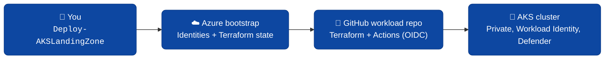

# AKS Application Landing Zone Accelerator

Deploy a production-ready **AKS cluster on Azure** in under an hour using a single PowerShell command.

---

## Start here

| I want to... | Go to |
|---|---|
| Deploy AKS for the first time | **[QUICKSTART.md](QUICKSTART.md)** |
| Configure scenarios, drift, multi-env, troubleshoot | [ADVANCED.md](ADVANCED.md) |
| See what's GA and what's tech preview | [KNOWN-ISSUES.md](KNOWN-ISSUES.md) |
| Read release notes | [CHANGELOG.md](CHANGELOG.md) |

---

## What's GA in v1.4.0

| Topology | Description | Status |
|---|---|---|
| `standalone` | No hub. NAT gateway egress only. Great for dev/test & PoCs. | ✅ GA (single + multi-region) |
| `hub_and_spoke` | Accelerator creates the hub VNet + Azure Firewall + spoke. | ✅ GA (single region) |
| `spoke` | Peer the AKS spoke to your **existing** ALZ hub VNet. | ⚠️ Available but not in v1.4.0 validation matrix |

Regulated topologies and multi-region hub-and-spoke are tech preview — see [KNOWN-ISSUES.md](KNOWN-ISSUES.md).

---

## Project status

- License: [MIT](LICENSE)
- Security: [SECURITY.md](SECURITY.md)
- Code of Conduct: [CODE_OF_CONDUCT.md](CODE_OF_CONDUCT.md)
