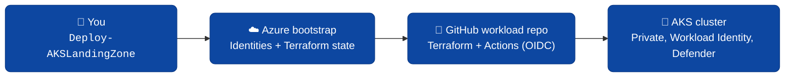

# AKS Application Landing Zone Accelerator

[](CHANGELOG.md)
[](LICENSE)

Deploy a production-ready **AKS cluster on Azure** in under an hour using a single PowerShell command.

> [!IMPORTANT]
> **Using the accelerator?** Go to the documentation site — everything you need to deploy is there:
> ### 👉 https://abengtss-max.github.io/aksapplz/
> This repository is the **developer / source** home. The sections below are for contributors.



---

## Try it (latest release)

```powershell
& ([scriptblock]::Create((Invoke-RestMethod https://raw.githubusercontent.com/abengtss-max/aksapplz/main/install.ps1)))
Deploy-AKSLandingZone
```

Pin a version with `-Release v1.4.0`. Full guidance on the
[docs site](https://abengtss-max.github.io/aksapplz/).

---

## Documentation

The customer-facing docs live on the **[documentation site](https://abengtss-max.github.io/aksapplz/)**
(built from [`docs/`](docs/) with MkDocs Material and deployed to GitHub Pages).

| Topic | User docs (site) | Source in repo |
|---|---|---|
| Get started | [Quickstart](https://abengtss-max.github.io/aksapplz/get-started/quickstart/) | [docs/get-started/](docs/get-started/) |
| Scenarios & options | [Scenarios](https://abengtss-max.github.io/aksapplz/get-started/scenarios/) | [docs/get-started/scenarios.md](docs/get-started/scenarios.md) |
| Releases & versions | [Releases](https://abengtss-max.github.io/aksapplz/releases/) | [docs/releases.md](docs/releases.md) |
| Known issues | [Known issues](https://abengtss-max.github.io/aksapplz/known-issues/) | [KNOWN-ISSUES.md](KNOWN-ISSUES.md) |

---

## Repository layout

| Path | Purpose |
|---|---|
| `ALZ.AKS/` | The published PowerShell module (`Deploy-AKSLandingZone`) + embedded Terraform/workflow templates |
| `terraform/` | Canonical Terraform composition (root + region module) |
| `bootstrap/` | Legacy standalone bootstrap script (superseded by the module) |
| `docs/` + `mkdocs.yml` | Documentation site (MkDocs Material → GitHub Pages) |
| `install.ps1` | Customer entrypoint: resolves latest/pinned release and imports the module |
| `config/` | Example `inputs.*.yaml` / `*.tfvars` per scenario |
| `.github/workflows/` | CI, scenario tests, `docs.yml` (Pages), `release.yml` (tag → GitHub Release) |

---

## Contributing

```powershell
git clone https://github.com/abengtss-max/aksapplz.git
cd aksapplz
Import-Module .\ALZ.AKS\ALZ.AKS.psd1 -Force
```

- Preview the docs locally: `pip install -r requirements-docs.txt` then `mkdocs serve`.
- Tests and validation: see [TEST.md](TEST.md).
- Cutting a release: bump `ModuleVersion` in [ALZ.AKS/ALZ.AKS.psd1](ALZ.AKS/ALZ.AKS.psd1), then push a `vX.Y.Z` tag — `release.yml` does the rest.

---

## What's GA in v1.4.0

| Topology | Description | Status |
|---|---|---|
| `standalone` | No hub. NAT gateway egress only. Great for dev/test & PoCs. | ✅ GA (single + multi-region) |
| `hub_and_spoke` | Accelerator creates the hub VNet + Azure Firewall + spoke. | ✅ GA (single region) |
| `spoke` | Peer the AKS spoke to your **existing** ALZ hub VNet. | ⚠️ Available but not in v1.4.0 validation matrix |

Regulated topologies and multi-region hub-and-spoke are tech preview — see [KNOWN-ISSUES.md](KNOWN-ISSUES.md).

---

## Project status

- License: [MIT](LICENSE)
- Security: [SECURITY.md](SECURITY.md)
- Code of Conduct: [CODE_OF_CONDUCT.md](CODE_OF_CONDUCT.md)
