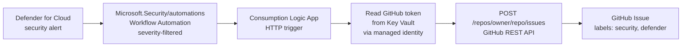

# Defender ticketing (work-item automation)

Once Microsoft Defender for Cloud findings are *visible* on the Grafana dashboards
([#35](https://github.com/abengtss-max/aksapplz/issues/35),
[#36](https://github.com/abengtss-max/aksapplz/issues/36)), the next maturity step is to
*act* on them automatically. Microsoft recommends automating security response rather than
relying on manual dashboard review: surfacing alerts is Tier 1, automatically creating
tracked work items is Tier 2.

This accelerator can automatically turn Defender for Cloud security **alerts** into
**GitHub Issues** — opt-in, and off by default.

!!! note "GitHub today; other trackers later"
    Only the **GitHub Issues** target is implemented. The `defender_ticketing_target`
    selector reserves `azuredevops` and `servicenow` so those can be added later without a
    breaking change.

## How it works



1. **Defender for Cloud Workflow Automation** (`Microsoft.Security/automations`), scoped to
   the subscription, fires on every qualifying security alert and POSTs the alert payload to
   the Logic App. The rule set filters by severity, so only alerts at or above
   `defender_ticketing_min_severity` reach the Logic App.
2. A **Consumption Logic App** (system-assigned managed identity) receives the alert.
3. The Logic App **reads the GitHub token from Key Vault at runtime** using its managed
   identity — the token is never inlined in code, Terraform state, or the workflow
   definition.
4. The Logic App calls the **GitHub REST API** to create an issue whose title/body carry the
   alert severity, description, affected resource, remediation, and a deep link back to
   Defender for Cloud.

## Enable it

1. **Create a GitHub token** with permission to create issues in the target repository — a
   fine-grained PAT with `Issues: write`, or a GitHub App installation token.
2. **Store the token in Key Vault** (the deployment's primary-region Key Vault) as a secret,
   e.g. `github-issues-token`. Never put it in `inputs.yaml` or `tfvars`.
3. **Set the configuration** (see the
   [Configuration reference](../reference/configuration.md#defender-work-item-automation)):

    ```yaml
    enable_defender_workflow_automation: true
    defender_ticketing_target: github
    defender_ticketing_github_repository: owner/repo
    defender_ticketing_github_pat_secret_name: github-issues-token
    defender_ticketing_min_severity: High   # Low | Medium | High
    ```

4. Make sure the `security` and `defender` labels (or whatever you set in
   `defender_ticketing_github_labels`) **already exist** in the target repository — GitHub
   does not create labels implicitly when an issue is created.

The managed identity of the Logic App is automatically granted **Key Vault Secrets User** on
the primary-region Key Vault so it can read the token.

## Networking caveat (private deployments)

A **Consumption** Logic App runs on the Azure multi-tenant Logic Apps service and reaches
Key Vault over its **public** endpoint. When the primary Key Vault has public access disabled
(`enable_private_endpoints`), the runtime token fetch cannot reach it. In that case:

- store the token in a Key Vault that permits **trusted Azure services** (or a dedicated
  ticketing Key Vault reachable by the Logic App), **or**
- move to a **VNet-integrated Standard Logic App** ([tracked in #42](https://github.com/abengtss-max/aksapplz/issues/42)).

The GitHub API call itself is outbound to the public internet and is unaffected.

## Cost & safety

- Nothing is provisioned and **no cost is incurred** while
  `enable_defender_workflow_automation` is `false` (the default).
- A Consumption Logic App is billed per action execution; volume tracks how many qualifying
  alerts Defender raises. Start with `defender_ticketing_min_severity: High` to keep noise
  and cost low.
- Alerts are the trigger source today. Recommendation-driven tickets and de-duplication of
  repeat firings are potential follow-ups.

Related: [#35](https://github.com/abengtss-max/aksapplz/issues/35),
[#36](https://github.com/abengtss-max/aksapplz/issues/36) (Defender/Grafana visibility),
[#31](https://github.com/abengtss-max/aksapplz/issues/31) (Microsoft Sentinel SIEM — an
alternative/complementary SOAR surface).
