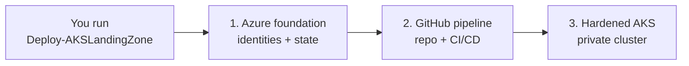

# How it works & glossary

New to Azure Kubernetes or landing zones? Start here. This page explains the big
picture in plain language and defines the terms you'll see across the rest of the docs.

## The big picture

You run **one command** on your laptop. That command builds three things, in order:

1. **A foundation in Azure** — the identities, permissions, and storage the automation
   needs to run safely (no passwords stored anywhere).
2. **A deployment pipeline in GitHub** — a new Git repository with ready-made CI/CD
   workflows that deploy and update your infrastructure going forward.
3. **A hardened AKS cluster** — a private, secure Kubernetes environment wired up with
   the networking, security, and monitoring Microsoft recommends.

The result is a **repeatable, production-ready starting point** — instead of clicking
through the Azure portal and wiring dozens of services together by hand, you get a
tested blueprint in about an hour.

## Who this is for

- **Platform / DevOps / cloud engineers** who need a secure AKS environment fast.
- Teams that want **Microsoft-recommended defaults** baked in, not assembled by hand.
- Anyone standing up a **new** AKS landing zone, or a repeatable dev/test cluster.

**Not** a beginner tutorial for *learning* Kubernetes, and not a managed service — you
own and pay for the Azure resources it creates.

## Glossary

| Term | What it means |
|---|---|
| **AKS** | Azure Kubernetes Service — Microsoft's managed Kubernetes. It runs your containerized apps. |
| **Landing zone** | A pre-built, best-practice environment (networking, identity, security, governance) that workloads "land" into. This project builds an *application* landing zone for AKS. |
| **Accelerator** | Automation that stands up that environment for you, following a proven pattern — so you don't start from a blank page. |
| **Bootstrap** | The one-time first step that creates the identities and Terraform state the automation needs before it can build anything else. |
| **Terraform** | An infrastructure-as-code tool. It describes your Azure resources as files, so deployments are repeatable and reviewable. |
| **Terraform state** | A file that records what Terraform has created, so it knows what to change next time. It's stored securely in Azure. |
| **CI/CD** | Continuous Integration / Continuous Delivery — automated pipelines (here, GitHub Actions) that deploy and update your infrastructure. |
| **OIDC** | OpenID Connect — lets GitHub Actions sign in to Azure with short-lived tokens instead of stored secrets. More secure. |
| **PAT** | Personal Access Token — a GitHub credential the accelerator uses to create your workload repository. |
| **Workload Identity** | Lets pods in the cluster get Azure permissions without secrets. |
| **Hub & spoke** | A network design: a central "hub" for shared services (firewall, connectivity) and "spokes" for workloads. See [Topologies](topologies.md). |
| **Standalone** | The simplest network option — no hub, direct egress via a NAT gateway. Best for a first run. |
| **ACR** | Azure Container Registry — stores your container images. |
| **WAF** | Web Application Firewall — filters malicious inbound web traffic. |
| **Defender for Containers** | Microsoft's security monitoring for Kubernetes. |
| **PCI-DSS** | A security standard for handling payment card data. The "regulated" scenarios harden the cluster toward it. |

---

Ready? Head to the **[Planning checklist](../get-started/planning-checklist.md)** to make
your decisions, then **[Choose a scenario](../get-started/scenarios.md)**.
