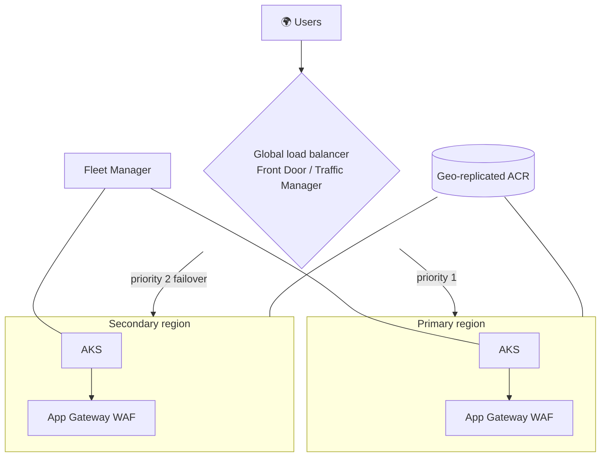

# Multi-region

Setting a `secondary_location` provisions a complete second region — AKS, App Gateway, VNet,
Key Vault, and monitoring — from a single run, with a global load balancer wired across both.

## What gets built

- **Two full regional stacks** from one reusable region module (`for_each`)
- **A global load balancer** with both regions pre-wired as origins/endpoints and priority failover
- **Azure Kubernetes Fleet Manager** auto-joining both clusters
- **Geo-replicated ACR** across the two regions
- **Flux v2 GitOps** for consistent multi-cluster deployment
- **VPA** for right-sizing across regions
- **Azure Backup** for cross-region recovery

## Choosing a global load balancer

| Option | When to use |
|---|---|
| **Azure Front Door** (default) | HTTP/S apps that benefit from a global edge, WAF, caching, and TLS offload |
| **Traffic Manager** | DNS-based routing for non-HTTP workloads or when you need protocol-agnostic failover |

Set the choice via `global_lb_type` in your config. Failover is priority-based: traffic flows to
the primary region until it's unhealthy, then to the secondary, and fails back automatically when
the primary recovers.

## Availability zones

Each region spreads node pools and zone-redundant resources (ACR, App Gateway) across availability
zones where the region supports them. Per-region zone selection is surfaced in the wizard.

!!! tip
    Front Door endpoints take a few minutes to propagate globally after creation. A brief `404`
    from the edge immediately after deploy is expected, not a misconfiguration.
