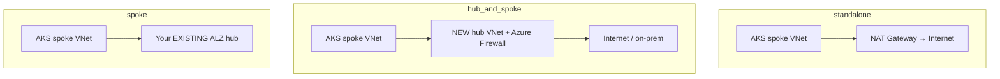

# Topologies

The accelerator supports three networking topologies. The wizard asks which one you want — this
page explains the trade-offs.

| Topology | What it creates | Best for | Status |
|---|---|---|---|
| `standalone` | AKS spoke + NAT gateway egress, no hub | Dev/test, PoCs, isolated subscriptions | ✅ GA (single + multi-region) |
| `hub_and_spoke` | A **new** hub VNet + Azure Firewall + the spoke peered to it | Greenfield enterprise | ✅ GA (single region) |
| `spoke` | The AKS spoke peered to an **existing** hub VNet you already own | Brownfield: you already have an ALZ hub | ⚠️ Available, not in current validation matrix |

## standalone

No hub. Egress is via a NAT gateway. This is the fastest path and the recommended choice for a
first run. Ideal when the subscription is isolated and you don't need centralized inspection.

## hub_and_spoke

The accelerator provisions a brand-new hub VNet with **Azure Firewall** plus the AKS spoke peered
to it. Choose this for greenfield enterprise deployments where the accelerator owns the whole
network. You provide the hub address space and firewall SKU during the wizard.

!!! note "Cost"
    Azure Firewall (Standard) runs continuously. Tear the environment down when you're done
    evaluating to avoid ongoing charges.

## spoke

Peer the AKS spoke into a hub VNet you already manage (a typical brownfield ALZ). You supply the
existing hub VNet resource ID during the wizard.

## Ingress options

Topology controls egress and peering; ingress is a separate set of toggles that coexist:

| Option | Purpose |
|---|---|
| `enable_app_gateway` | Application Gateway WAF v2 — L7 ingress with a Web Application Firewall |
| `enable_agc` | Application Gateway for Containers (ALB) — provisions the delegated subnet + NSG; the in-cluster ALB Controller manages the data plane |

Both are regional. For global traffic distribution across regions, see
**[Multi-region](multi-region.md)**.
