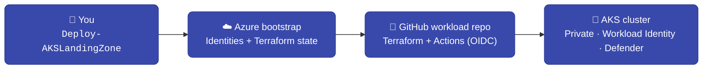

# AKS Landing Zone Accelerator

> Deploy a production-ready **AKS cluster on Azure** in under an hour with a single PowerShell command.

This accelerator bootstraps a complete AKS Application Landing Zone — identities, Terraform
state, a GitHub workload repo with CI/CD, and a hardened AKS cluster — following the same
phased pattern as the [Azure Landing Zone Accelerator](https://azure.github.io/Azure-Landing-Zones/).



---

## The journey — three steps

<div class="grid cards" markdown>

-   :material-numeric-1-circle:{ .lg .middle } **Prepare**

    ---

    Install five tools, sign in to Azure as Owner, and create a GitHub PAT.

    [:octicons-arrow-right-24: Prerequisites](get-started/prerequisites.md)

-   :material-numeric-2-circle:{ .lg .middle } **Deploy**

    ---

    Run one command. An interactive wizard walks you through everything.

    [:octicons-arrow-right-24: Quickstart](get-started/quickstart.md)

-   :material-numeric-3-circle:{ .lg .middle } **Choose a scenario**

    ---

    Pick a pre-tuned blueprint — baseline or PCI-DSS regulated, single or multi-region.

    [:octicons-arrow-right-24: Scenarios](get-started/scenarios.md)

</div>

---

## Get started in one command

```powershell
# Always install & run the latest release
& ([scriptblock]::Create((Invoke-RestMethod https://raw.githubusercontent.com/abengtss-max/aksapplz/main/install.ps1)))
Deploy-AKSLandingZone
```

Want a specific, locked version instead? See [Releases & versions](releases.md).

---

## What you get

| Capability | Detail |
|---|---|
| **Private AKS cluster** | Azure CNI Overlay, Workload Identity, Azure RBAC, Defender for Containers |
| **Networking topologies** | `standalone`, `hub_and_spoke`, or peer to an existing `spoke` |
| **Ingress** | Application Gateway WAF v2, and optional Application Gateway for Containers (ALB) |
| **Multi-region** | Front Door / Traffic Manager, Fleet Manager, geo-replicated ACR — from one run |
| **Supply chain** | ACR (Premium, zone-redundant) + Key Vault, all via Azure Verified Modules |
| **GitOps CI/CD** | A GitHub workload repo with OIDC pipelines — no stored cloud secrets |
| **Regulated option** | PCI-DSS 4.0.1 hardening: Premium SKU, Azure network policy, Istio mTLS, FIPS |

---

## New here?

Start with **[Prerequisites](get-started/prerequisites.md)**, then the **[Quickstart](get-started/quickstart.md)**.
If you just want to understand the architecture first, read **[Topologies](concepts/topologies.md)**.
