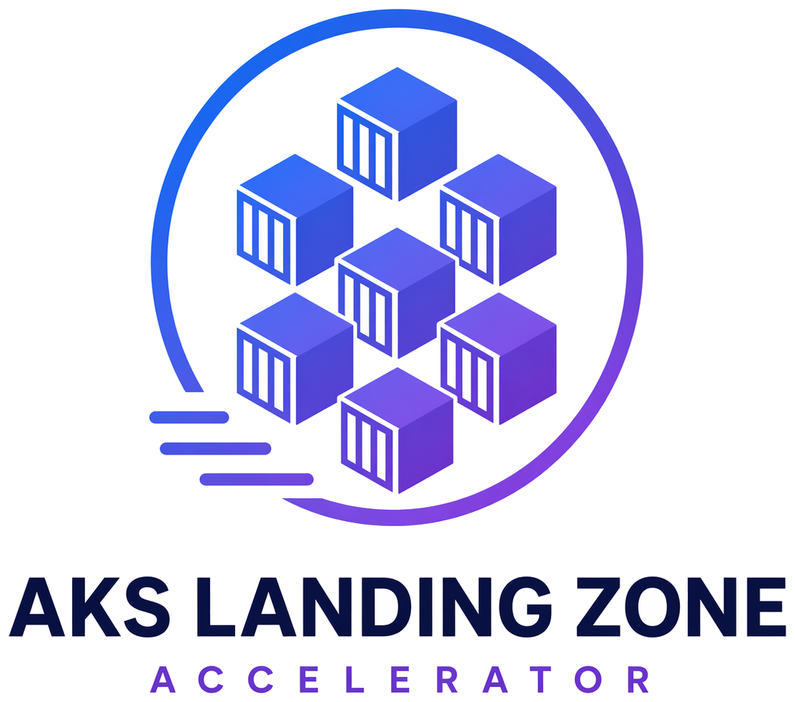

<p align="center">
  
</p>

# AKS Landing Zone Accelerator

> Deploy a production-ready **AKS cluster on Azure** in under an hour with a single PowerShell command.
{: .hero-tagline }

<div class="badge-row" markdown>
[](https://github.com/abengtss-max/aksapplz/releases)
[](https://github.com/abengtss-max/aksapplz/blob/main/LICENSE)
[](https://azure.github.io/Azure-Verified-Modules/)
</div>

## What is this?

**In one sentence:** instead of clicking through the Azure portal and wiring dozens of
services together by hand, you run **one command** and get a secure, best-practice Azure
Kubernetes environment — plus a Git-based pipeline to keep deploying to it.

It bootstraps a complete AKS Application Landing Zone — identities, Terraform state, a
GitHub workload repo with CI/CD, and a hardened AKS cluster — following the same phased
pattern as the [Azure Landing Zone Accelerator](https://azure.github.io/Azure-Landing-Zones/).

!!! success "Who this is for"
    Platform, DevOps, and cloud engineers who need a **secure AKS environment fast**, with
    Microsoft-recommended defaults baked in. Great for a new landing zone or a repeatable
    dev/test cluster.

!!! note "Who it's *not* for"
    It isn't a beginner tutorial for *learning* Kubernetes, and it isn't a managed service —
    **you own and pay for** the Azure resources it creates. New to the vocabulary?
    Start with **[How it works & glossary](concepts/glossary.md)**.

<p align="center">
  
</p>

<div class="hero-cta" markdown>
[:material-rocket-launch: Get started](get-started/planning-checklist.md){ .md-button .md-button--primary }
[:material-book-open-variant: How it works](concepts/glossary.md){ .md-button }
[:material-sitemap: See the architecture](get-started/scenarios.md){ .md-button }
</div>

---

## Your path — four steps

The diagram above shows what gets *built*; here's what *you* do. Decisions first, then setup, then deploy.

<div class="grid cards" markdown>

-   :material-numeric-1-circle:{ .lg .middle } **Plan**

    ---

    Make your decisions first. Download the planning checklist and agree on names, networks, and add-ons.

    [:octicons-arrow-right-24: Planning checklist](get-started/planning-checklist.md)

-   :material-numeric-2-circle:{ .lg .middle } **Choose a scenario**

    ---

    Pick a pre-tuned blueprint — baseline or PCI-DSS regulated, single or multi-region.

    [:octicons-arrow-right-24: Scenarios](get-started/scenarios.md)

-   :material-numeric-3-circle:{ .lg .middle } **Prerequisites**

    ---

    Install the tools, sign in to Azure as Owner, and create a GitHub PAT.

    [:octicons-arrow-right-24: Prerequisites](get-started/prerequisites.md)

-   :material-numeric-4-circle:{ .lg .middle } **Deploy**

    ---

    Run one command. An interactive wizard walks you through everything.

    [:octicons-arrow-right-24: Quickstart](get-started/quickstart.md)

</div>

---

## Get started in one command

```powershell
# Always install & run the latest release
& ([scriptblock]::Create((Invoke-RestMethod https://raw.githubusercontent.com/abengtss-max/aksapplz/main/install.ps1)))
Deploy-AKSLandingZone
```

!!! question "Is it safe to run that one-liner?"
    Yes — and you're encouraged to check first. The command downloads our open-source
    [`install.ps1`](https://github.com/abengtss-max/aksapplz/blob/main/install.ps1), which
    fetches a tagged release of the PowerShell module and makes the `Deploy-AKSLandingZone`
    command available. Nothing is deployed to Azure until you run the wizard and **explicitly
    confirm**. Prefer to inspect it yourself first? Open the script, or pin an exact version below.

Want a specific, locked version instead? See [Releases & versions](releases.md).

---

## What you get

**In short:** a private, secure Kubernetes cluster, the networking and security guardrails
Azure recommends, and a Git-based pipeline to deploy to it — all built for you.

<div class="grid cards" markdown>

-   :material-shield-lock:{ .lg .middle } **Security by default**

    ---

    Private AKS cluster, Workload Identity, Azure RBAC, Defender for Containers, and a
    Key Vault — no secrets stored anywhere.

-   :material-lan:{ .lg .middle } **Networking your way**

    ---

    `standalone`, `hub_and_spoke`, or peer to an existing `spoke`, with Application
    Gateway WAF v2 (and optional Gateway for Containers) for ingress.

-   :material-source-branch:{ .lg .middle } **GitOps CI/CD**

    ---

    A GitHub workload repo with OIDC pipelines that deploy and update your
    infrastructure — no stored cloud secrets.

-   :material-earth:{ .lg .middle } **Multi-region ready**

    ---

    Front Door / Traffic Manager, Fleet Manager, and geo-replicated ACR across two
    regions — from a single run.

</div>

??? abstract "Full capability list"
    | Capability | Detail |
    |---|---|
    | **Private AKS cluster** | Azure CNI Overlay, Workload Identity, Azure RBAC, Defender for Containers |
    | **Networking topologies** | `standalone`, `hub_and_spoke`, or peer to an existing `spoke` |
    | **Ingress** | Application Gateway WAF v2, and optional Application Gateway for Containers (ALB) |
    | **Multi-region** | Front Door / Traffic Manager, Fleet Manager, geo-replicated ACR — from one run |
    | **Supply chain** | ACR (Premium, zone-redundant) + Key Vault, all via Azure Verified Modules |
    | **GitOps CI/CD** | A GitHub workload repo with OIDC pipelines — no stored cloud secrets |
    | **Regulated option** | PCI-DSS 4.0.1 hardening: Premium SKU, Azure network policy, Istio mTLS, FIPS |

---

## What will it cost?

You pay Azure directly for the resources this creates — there's no charge for the accelerator
itself. Cost depends on the scenario and options you pick:

- **`standalone` (recommended first run)** is the cheapest — a small cluster plus a NAT
  gateway. Good for evaluating.
- **`hub_and_spoke`** adds an **Azure Firewall**, which runs continuously and is a notable
  cost driver.
- **Multi-region** and **regulated (Premium SKU)** scenarios roughly multiply the footprint.

!!! tip "Keep costs predictable"
    Estimate before you deploy with the [Azure Pricing Calculator](https://azure.microsoft.com/pricing/calculator/),
    and **tear everything down** when you're done evaluating:
    `Deploy-AKSLandingZone -Environment <env> -Action destroy -AutoApprove`.

---

## See the wizard before you run it

The deploy command is an **interactive wizard** — it asks a short series of questions, shows
you the config it will use, and only builds anything after you confirm.

<p align="center">
  
</p>

??? example "Prefer text? Here's the same flow"
    ```text
      AKS Landing Zone Accelerator
      ────────────────────────────────────────────
      1) Scenario ......................... single_region_baseline
      2) Bootstrap region ................. swedencentral
      3) Bootstrap subscription ........... [1] Contoso-Dev  (a1b2...)
      4) Topology ......................... standalone
      5) AKS subscription ................. [1] Contoso-Dev  (a1b2...)
      6) service_name ..................... aksapplz
      7) environment_name ................. dev01
      8) GitHub org ....................... my-org

      Review config/inputs.dev01.yaml? [Y/n]
      Proceed with deployment? [y/N]
    ```

Every answer is saved to `config/inputs.<env>.yaml`, so future runs can be fully
non-interactive. See the **[Quickstart](get-started/quickstart.md)** for the full walkthrough.

---

## Ready to start?

[:material-rocket-launch: Plan your decisions](get-started/planning-checklist.md){ .md-button .md-button--primary }

New to the terms? Read **[How it works & glossary](concepts/glossary.md)** first.
